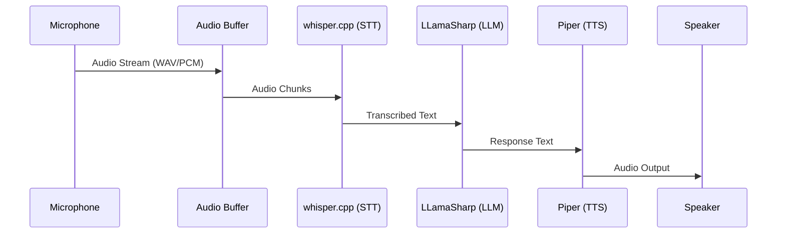

# LocalLizard Voice Pipeline Design

**Author:** Flux  
**Date:** 2026-04-17  
**Task:** T2 - Voice pipeline design  
**Status:** COMPLETED

## Overview

This document outlines the design for integrating speech-to-text (STT), large language model (LLM), and text-to-speech (TTS) components into a cohesive voice pipeline for the LocalLizard project.

## Architecture Components

### 1. Speech-to-Text (STT): whisper.cpp
- **Purpose**: Convert spoken audio to text
- **Implementation**: Process wrapper for whisper.cpp executable
- **Input**: Audio stream (WAV/PCM format)
- **Output**: Transcribed text
- **Integration**: C# `Process` class with stdin/stdout communication

### 2. Large Language Model (LLM): LLamaSharp + Gemma GGUF
- **Purpose**: Generate conversational responses
- **Implementation**: LLamaSharp NuGet package
- **Input**: Text from STT + conversation history
- **Output**: Response text
- **Integration**: Direct C# API calls

### 3. Text-to-Speech (TTS): Piper
- **Purpose**: Convert text responses to speech
- **Implementation**: Process wrapper for piper executable
- **Input**: Text from LLM
- **Output**: Audio stream (WAV format)
- **Integration**: C# `Process` class with stdin/stdout communication

## Pipeline Flow



## Detailed Design

### 1. Audio Capture & Processing
```csharp
public class AudioCaptureService
{
    // Captures microphone input
    // Converts to WAV/PCM format for whisper.cpp
    // Buffers audio for real-time processing
}
```

### 2. whisper.cpp Integration
```csharp
public class WhisperSTTService
{
    private Process _whisperProcess;
    
    public async Task<string> TranscribeAsync(byte[] audioData)
    {
        // Write audio to whisper.cpp stdin
        // Read transcribed text from stdout
        // Handle errors and timeouts
    }
}
```

### 3. LLM Integration
```csharp
public class LLMService
{
    private LlamaProcessor _llama;
    
    public async Task<string> GenerateResponseAsync(string input, ConversationHistory history)
    {
        // Use LLamaSharp to load Gemma GGUF model
        // Generate response with context
        // Manage conversation history
    }
}
```

### 4. Piper Integration
```csharp
public class PiperTTSService
{
    private Process _piperProcess;
    
    public async Task<byte[]> SynthesizeAsync(string text)
    {
        // Write text to piper stdin
        // Read WAV audio from stdout
        // Handle voice model selection
    }
}
```

### 5. Pipeline Orchestrator
```csharp
public class VoicePipeline
{
    private AudioCaptureService _audioCapture;
    private WhisperSTTService _stt;
    private LLMService _llm;
    private PiperTTSService _tts;
    
    public async Task RunConversationLoopAsync()
    {
        // Main loop: Capture → STT → LLM → TTS → Play
        // Handle interruptions
        // Manage state and errors
    }
}
```

## C# Implementation Details

### Process Wrapper Pattern
Both whisper.cpp and Piper will use a similar process wrapper pattern:

```csharp
public abstract class ProcessWrapperService
{
    protected Process StartProcess(string executable, string arguments)
    {
        var process = new Process
        {
            StartInfo = new ProcessStartInfo
            {
                FileName = executable,
                Arguments = arguments,
                UseShellExecute = false,
                RedirectStandardInput = true,
                RedirectStandardOutput = true,
                RedirectStandardError = true,
                CreateNoWindow = true
            }
        };
        
        process.Start();
        return process;
    }
    
    protected async Task<string> ReadOutputWithTimeout(Process process, int timeoutMs = 10000)
    {
        var readTask = process.StandardOutput.ReadToEndAsync();
        var timeoutTask = Task.Delay(timeoutMs);
        
        var completedTask = await Task.WhenAny(readTask, timeoutTask);
        if (completedTask == timeoutTask)
        {
            throw new TimeoutException("Process output timeout");
        }
        
        return await readTask;
    }
}
```

### Audio Format Considerations
- **whisper.cpp**: Expects WAV/PCM format at 16kHz, mono
- **Piper**: Outputs WAV format, configurable sample rate (typically 22.05kHz)
- **Conversion**: May need `NAudio` NuGet package for audio format conversion

### Threading Model
- Audio capture: Dedicated thread/background service
- STT processing: Async/await with cancellation
- LLM inference: Can be CPU-intensive, consider separate thread pool
- TTS synthesis: Async processing
- Audio playback: Separate thread to avoid blocking

## Implementation Plan

### Phase 1: Component Testing
1. Test whisper.cpp with sample audio files
2. Test Piper with sample text
3. Test LLamaSharp with Gemma GGUF model

### Phase 2: Basic Integration
1. Create C# wrappers for whisper.cpp and Piper
2. Implement simple STT → LLM → TTS chain
3. Test with file-based input/output

### Phase 3: Real-time Pipeline
1. Add audio capture from microphone
2. Implement audio buffering and streaming
3. Add real-time playback
4. Implement conversation history

### Phase 4: Polish & Optimization
1. Add error handling and recovery
2. Optimize performance (threading, batching)
3. Add configuration options
4. Implement logging and monitoring

## Dependencies

### Required Software
1. **whisper.cpp**: Compiled executable for STT
2. **Piper**: Compiled executable for TTS  
3. **LLamaSharp**: NuGet package for .NET
4. **Gemma GGUF**: Model file for LLM
5. **Voice model**: Piper-compatible voice model

### System Requirements
- .NET 10.0 SDK (we have 10.0.106 installed)
- Sufficient RAM for LLM (4GB+ for Gemma 2B)
- CPU with AVX2 support (for whisper.cpp)
- Audio input/output devices

## Configuration

```json
{
  "Whisper": {
    "ExecutablePath": "./whisper.cpp/main",
    "ModelPath": "./models/ggml-base.bin",
    "Language": "en",
    "Threads": 4
  },
  "LLM": {
    "ModelPath": "./models/gemma-2b-it.gguf",
    "ContextSize": 4096,
    "Threads": 8
  },
  "Piper": {
    "ExecutablePath": "./piper/piper",
    "ModelPath": "./voices/en_US-amy-medium.onnx",
    "SampleRate": 22050
  },
  "Audio": {
    "SampleRate": 16000,
    "Channels": 1,
    "BufferSizeMs": 1000
  }
}
```

## Error Handling

### Common Failure Points
1. **whisper.cpp not found**: Check executable path
2. **Model loading failed**: Verify model file integrity
3. **Audio device issues**: Check permissions and drivers
4. **Memory exhaustion**: Monitor RAM usage, implement fallbacks

### Recovery Strategies
- Retry failed operations with exponential backoff
- Fall back to text-only mode if audio fails
- Cache successful configurations
- Provide clear error messages to users

## Testing Strategy

### Unit Tests
- Individual component testing
- Mock external dependencies
- Validate input/output formats

### Integration Tests
- End-to-end pipeline testing
- Real audio file processing
- Performance benchmarking

### User Testing
- Real-world conversation testing
- Different accents and environments
- Long-duration stability testing

## Future Enhancements

### Short-term
1. Wake word detection
2. Multiple voice models
3. Conversation context management

### Medium-term  
1. GPU acceleration for whisper.cpp
2. Streaming response generation
3. Emotion/intonation control for TTS

### Long-term
1. Custom model fine-tuning
2. Multi-language support
3. Offline voice command recognition

## Conclusion

This design provides a practical approach to building a voice pipeline using existing open-source tools with C# integration. The process-wrapper approach balances simplicity with functionality, allowing us to leverage mature STT/TTS tools while maintaining a clean C# architecture.

The implementation can proceed incrementally, with each component tested independently before full integration. This modular approach will help identify and resolve issues early in the development process.